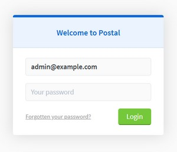

[//]: # (README.md generated by gotmpl. DO NOT EDIT.)

  

# Kubee Postal Chart

The `Kubee Postal Chart` is a `Kubee Chart` that installs [Postal](https://docs.postalserver.io/).

`Postal` is a `programmatic email server` known also as `Mail delivery platform`.

## Installation Steps

### Cluster Values file Configuration

Set this values in your cluster values file.
```yaml
# mandatory
postal:
  enabled: true
  hostname: 'postal.example.com' # You should own this domain
  conf_secrets:
    dkim_signing_key: '${KUBEE_POSTAL_SIGNING_KEY}' # Generate the private key via `openssl genrsa -out path/to/signing.key 2048`
    db_password: '${KUBEE_POSTAL_MARIADB_PASSWORD}'
    rails_secret_key: '${KUBEE_POSTAL_RAILS_SECRET}'
    smtp_password: '${KUBEE_POSTAL_SMTP_PASSWORD}'
# Only if you want to log in via dex
dex:
  enabled: true
  clients:
    postal:
      secret: '${KUBEE_DEX_POSTAL_SECRET}'
```

### Install

```bash
kubee -c clusterName helmet play postal
```

### Create your first user

* Connect to the web pods.
```bash
kubee -cluster clusterName app shell postal/web
```
* Enter the [make-user](https://docs.postalserver.io/getting-started/installation#initializing-the-database) command
```bash
postal make-user
```
* Enter the information
```bash
Loading config from /config/postal.yml
Postal User Creator
Enter the information required to create a new Postal user.
This tool is usually only used to create your initial admin user.

E-Mail Address      : admin@example.com
First Name          : Admin
Last Name           : Admin
Initial Password    : *********

User has been created with e-mail address admin@example.com
```
* Go to https://postal.example.com and login



## Features

### Automatic Auth Oidc configuration

If dex is enabled and the dex postal secret is not empty `.Values.dex.clients.postal.secret`,
`postal` is configured to log in via dex.

## Values

| Key | Type | Default | Description |
|-----|------|---------|-------------|
| conf_secrets.db_password | string | `""` | The database password |
| conf_secrets.dkim_signing_key | string | `""` | Private key It should be in pem format (BEGIN/END PRIVATE KEY) The signing.key can be generated using the following command: `openssl genrsa -out path/to/signing.key 2048` |
| conf_secrets.rails_secret_key | string | `""` | Rail Secret key (for signing payload) |
| conf_secrets.smtp_password | string | `""` | The password to use when authentication to the SMTP server |
| enabled | bool | `false` | Boolean to indicate that this chart is or will be installed in the cluster |
| hostname | string | `""` | The hostname You should own the apex domain as you need to [add DNS record](https://docs.postalserver.io/getting-started/dns-configuration) |
| namespace | string | `"postal"` | The installation Namespace |
| version | string | `"3.3.4"` | The postal [docker version](https://github.com/postalserver/postal/pkgs/container/postal) (The release version Without the v) |
| conf_yaml | object | | [The Postal Configuration without secrets and host](https://github.com/postalserver/postal/blob/3.3.4/doc/config/yaml.yml) |

By default, all username are named `postal`. You can change them in the `conf_yaml` postal configuration section.

## Contrib / Dev

See [contrib](contrib/contrib.md)

